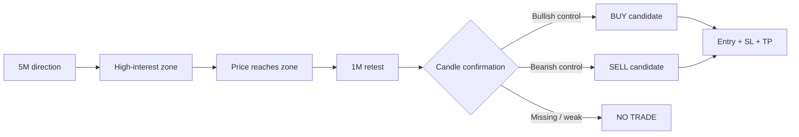

# Index Pro v3 Stable

### A rules-based intraday indicator for NIFTY, BANKNIFTY and SENSEX

> **Direction → Location → Retest → Confirmation → Entry → Protect → Target**

Index Pro v3 Stable is a single-overlay TradingView indicator designed to turn a disciplined scalping process into visible, repeatable chart rules. It combines higher-timeframe bias, volume-profile location, price-action confirmation, and defined trade levels without treating every candle as a signal.

**[Open the animated trading dashboard](index.html)**

## What it reads

| Module | What it shows | How it is used |
|---|---|---|
| **5M bias** | EMA 9/21, +DI, -DI and manual ADX | Defines bullish, bearish or ranging context |
| **Session profile** | POC, VAH and VAL | Maps the main auction and reaction area |
| **Price action** | FVGs, pivots and key strikes | Identifies possible locations, never automatic entries |
| **Volume** | Current volume vs 20-bar average | Highlights unusually active candles |
| **State machine** | WAIT → ZONE → REACTED → RETEST → SIGNAL | Prevents first-touch and chase entries |

## Signal logic

### Bullish setup

1. 5M EMA/ADX context is bullish.
2. Price reaches VAL, an FVG, POC, or another marked reaction zone.
3. Price retests the area instead of being bought on first touch.
4. A confirmed 1M bullish candle closes above the previous high with sufficient body and volume.
5. The indicator displays entry, invalidation stop, and risk/reward target.

### Bearish setup

The bearish flow mirrors the bullish flow: bearish 5M context, VAH/resistance location, retest, confirmed sellers, then a defined stop and target.

## Chart language

- **POC — Point of Control:** price with the most profile volume; a balance reference, not an automatic entry.
- **VAH — Value Area High:** upper edge of the main value area.
- **VAL — Value Area Low:** lower edge of the main value area.
- **FVG — Fair Value Gap:** inefficient fast-move area; a possible location, never a signal by itself.
- **ADX — Average Directional Index:** trend-strength measure; it does not define direction alone.
- **B / S circles:** high-volume candles with strong bullish or bearish bodies.

## Recommended setup

| Setting | Recommendation |
|---|---|
| Chart | 1-minute execution chart |
| Bias timeframe | 5 minutes |
| NIFTY strike interval | 50 |
| BANKNIFTY / SENSEX interval | 100 |
| Market session | 09:15–15:30, Asia/Kolkata |

## Risk discipline

- Define maximum session risk before trading.
- Never widen the stop after entry.
- Do not average down after invalidation.
- Do not chase candles or trade in the middle of balance.
- Backtest and paper trade before using live capital.

## Alerts

The indicator includes TradingView alerts for:

- Confirmed BUY and SELL signals
- Aggressive buyer and seller candles

## Installation

1. Open TradingView → **Pine Editor**.
2. Open `toolv3_stable.pine`.
3. Copy the complete script beginning with `//@version=6`.
4. Paste it into Pine Editor and click **Add to chart**.
5. Create alerts only after checking the selected symbol, timeframe and session.

## Disclaimer

Educational use only. This indicator does not guarantee profits or replace risk management. Validate every rule on historical data and paper trading before risking money.
